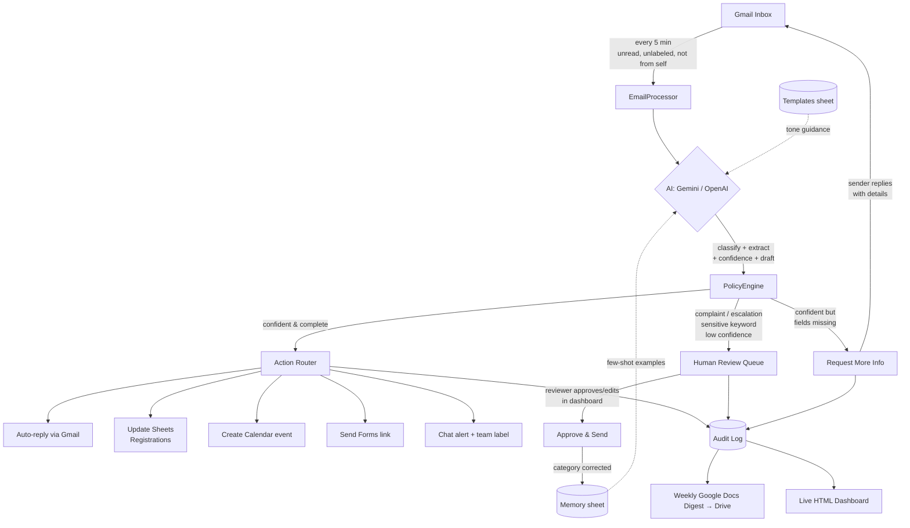

# OpsAgent — AI-Powered Operations Agent for Google Workspace

An autonomous email operations agent for student clubs, communities, and small organizations. It reads incoming Gmail, reasons about each message with an LLM (Gemini or OpenAI), applies organization-defined policies, and takes the right action — auto-replying, updating Sheets, creating Calendar events, sending Forms, routing to teams, and escalating sensitive cases to humans. It **learns from every human correction** and gets measurably better over time.

Built entirely on free Google Workspace tooling + Apps Script. No paid Google Cloud services required.

---

## Why it's a system, not a chatbot

| Capability | How |
|---|---|
| **Reads & understands email** | Time-driven trigger reads unread Gmail every 5 min; Gemini classifies + extracts structured fields |
| **Applies org policy** | Confidence thresholds, sensitive-keyword rules, and always-escalate categories — all editable in a sheet |
| **Takes real actions** | Auto-reply, Sheets updates, Calendar events, Forms links, Chat alerts, team routing, info requests |
| **Keeps humans in control** | Low-confidence / complaint / escalation emails go to a review queue; humans approve & send from the dashboard |
| **Learns over time** | Every human correction becomes a few-shot example injected into future prompts (the *memory loop*) |
| **Stays transparent** | Full audit log with the agent's own reasoning on every decision; weekly Google Docs digest |
| **Is operable by non-coders** | All thresholds, keywords, templates, team routing, and toggles live in editable sheets |

---

## Architecture

### Layers

1. **Ingestion** — `EmailProcessor.gs`: batch-capped, execution-time-guarded loop with idempotency (Gmail label), self-reply detection, and transient-failure retry/quarantine.
2. **Reasoning** — `GeminiService.gs`: provider-swappable (Gemini ↔ OpenAI), structured-JSON output, few-shot memory injection, template-guided tone.
3. **Policy** — `PolicyEngine.gs`: ordered rules → `auto` | `human_review` | `request_info`; per-category required fields; team routing map.
4. **Action** — `ActionRouter.gs`: Gmail, Sheets, Calendar, Forms, Chat, team labels.
5. **Human-in-the-loop** — `ReviewActions.gs` + `MemoryLoop.gs`: approve/dismiss from the dashboard or sheet; corrections feed the memory loop.
6. **Reporting** — `DigestReport.gs` (Google Docs + Drive) and `Dashboard.gs` + `dashboard.html` (live web app).

---

## Google technologies used

Gemini API · Gmail · Google Sheets · Google Apps Script · Google Calendar · Google Docs · Google Drive · Google Forms · Google Chat (webhooks)

---

## The Sheets workbook (your control panel)

| Tab | Purpose |
|---|---|
| **Config** | Thresholds, org name, model, webhooks, feature toggles — edit without touching code |
| **AuditLog** | Every email processed: category, confidence, actions, status, **and the agent's reasoning** |
| **HumanReview** | Low-confidence / complaint / escalation queue with override + approval |
| **Memory** | Human corrections, injected as few-shot examples into future prompts |
| **Registrations** | Auto-populated attendee list |
| **Templates** | Per-category tone & key-point guidance |
| **Routing** | Category → owning team map (drives team labels + notifications) |

---

## Setup

1. Create a Google Sheet → **Extensions → Apps Script**.
2. Add every `.gs` file and `dashboard.html`; paste `appsscript.json` into Project Settings (enable "Show manifest").
3. **Project Settings → Script Properties** → add `GEMINI_API_KEY` (and/or `OPENAI_API_KEY`).
4. Run **`setup()`** once; authorize the scopes.
5. Fill in the **Config** sheet (org name, optional Chat webhook + Form URLs).
6. **Deploy → New deployment → Web app** (Execute as: Me, Access: Anyone) → open the URL for your dashboard.

> Already running an older version? Run **`devUpgradeSheets()`** once to migrate sheets/labels/triggers non-destructively.

### Switching AI provider
Set `AI_PROVIDER` in the Config sheet to `gemini` (default) or `openai`. Each uses its own model row (`GEMINI_MODEL` / `OPENAI_MODEL`) and Script Property key.

---

## Demo script

1. **Seed the dashboard** — run `seedDemoData()` for an instantly populated dashboard (charts, queue, memory, trend). `clearDemoData()` resets it.
2. **Live registration** — from *another* email account, send "Register me for the AI Workshop on July 12" → click **Run Now** → watch the auto-reply, a Registrations row, and a Calendar event appear.
3. **Incomplete email** — send "I'd like to register!" with no date → agent replies asking for the date instead of confirming.
4. **Escalation** — send an email containing "legal" or "refund" → lands in Human Review with a Chat alert.
5. **The memory loop** — in the dashboard's Human Review tab, correct the category and **Approve & Send**; send a similar email again → the agent now classifies it correctly.
6. **Weekly digest** — click **Digest** → a formatted Google Doc opens from your Drive.

> For live demos, send from a different account — the agent intentionally skips mail from its own address.

---

## Reliability & safety notes

- **Idempotent**: a `OpsAgent/Processed` Gmail label prevents double-processing across overlapping runs.
- **Time-safe**: batch cap + a 4.5-minute guard keep runs under the Apps Script 6-minute limit; unprocessed mail resumes next run.
- **Failure-aware**: transient API errors retry (up to 3×) then quarantine; permanent errors quarantine immediately to `OpsAgent/Quarantine`.
- **Human-gated**: complaints and escalations *always* require human review, regardless of confidence.
- **Dry-run mode**: set `AUTO_REPLY_ENABLED = false` to classify and log without sending anything.

---

## File map

| File | Responsibility |
|---|---|
| `Setup.gs` | One-time setup, triggers, sheet scaffolding, migration helper |
| `Config.gs` | Cached config reads, API keys, constants |
| `GeminiService.gs` | LLM calls (Gemini/OpenAI), prompt building, few-shot injection |
| `PolicyEngine.gs` | Decision rules, required-field checks, team routing |
| `ActionRouter.gs` | Executes Gmail/Sheets/Calendar/Forms/Chat actions |
| `EmailProcessor.gs` | Main loop, idempotency, retries, dev helpers |
| `MemoryLoop.gs` | onEdit trigger + shared correction recorder |
| `ReviewActions.gs` | Approve & send / dismiss from the dashboard |
| `DigestReport.gs` | Weekly Google Docs digest → Drive |
| `Dashboard.gs` | Web-app backend + data functions |
| `dashboard.html` | Live dashboard (Tailwind + Alpine.js + Chart.js) |
| `DemoData.gs` | Seed/clear sample data for demos |

---

*Built for the AI-Powered Operations Agent challenge. See `devlog.md` for the full development story.*
